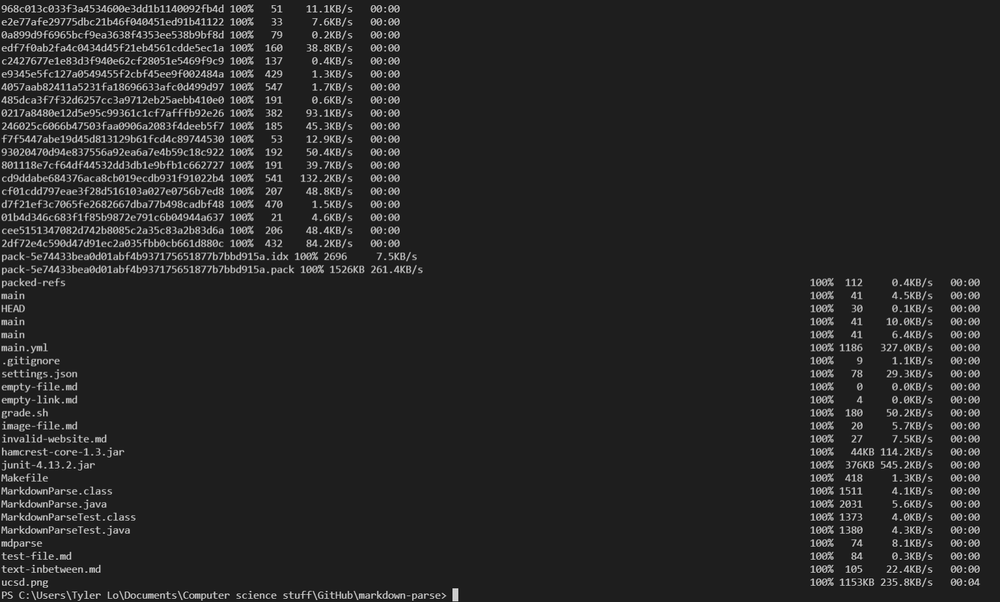
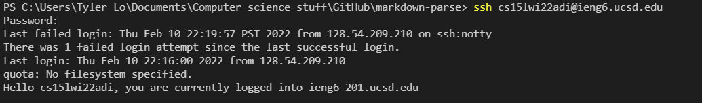
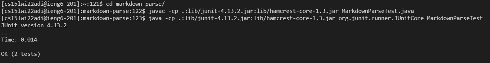
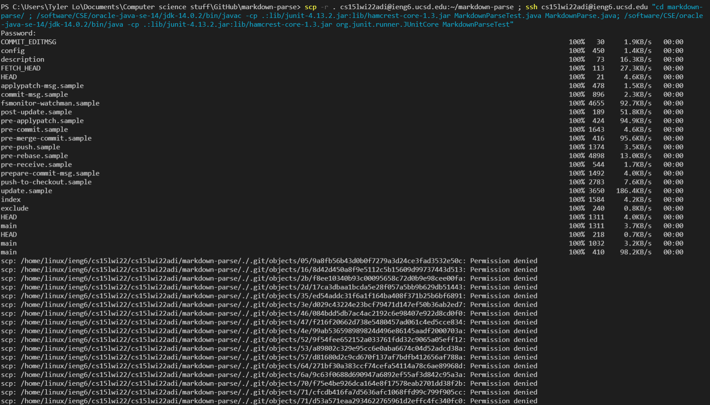
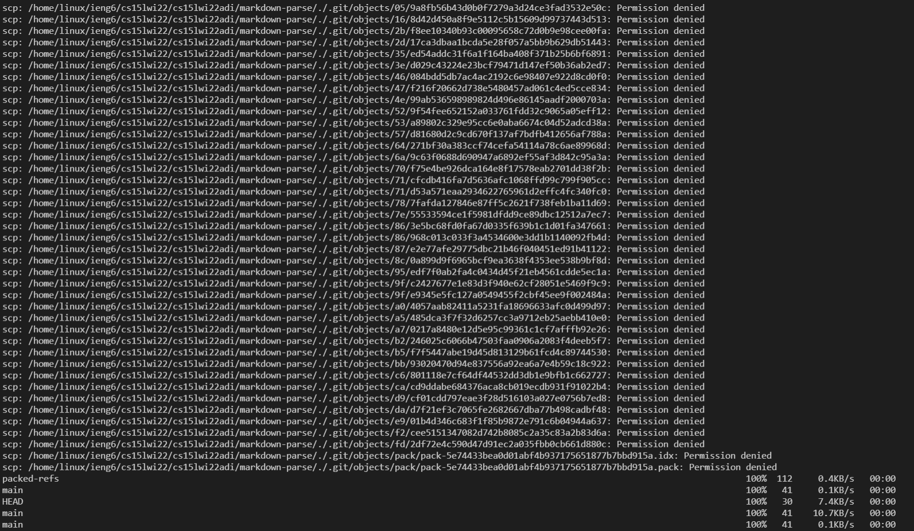
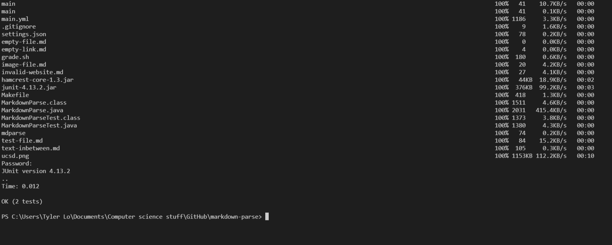

## Lab Report 3 Week 6: Option 3 ##
-------------------------

# Copying Markdown-Parse to ieng6 #

Copying over markdown parse is relatively straightforward. Using ```scp -r . cs15lwi22adi@ieng6.ucsd.edu:~/markdown-parse``` in the terminal copies the entire directory to the new server. This directory is represented by the ```.``` The ```-r``` tells scp to work recursively in order to copy all files in a directory (and all files in those files and directories). The ```~/markdown-parse``` creates the markdown-parse directory on the remote server and then copies the files inside the directory there.





# Running the copied tests #

I than logged into ieng6 and ran the javac junit files. It is important to note that although I am using a microsoft computer, I should use the Ubuntu linux commands because ieng6 runs on Ubuntu. This is also useful to be able to use linux by logging into ieng6. Before running the javac command, I need to use ```cd markdown-parse/``` to move to the correct directory.





# Running everything in one line #
To speed up the process of running the program on ieng6, running it all in one command will run the test on ieng6 and automatically log out.

```scp -r . cs15lwi22adi@ieng6.ucsd.edu:~/markdown-parse ; ssh cs15lwi22adi@ieng6.ucsd.edu "cd markdown-parse/ ; /software/CSE/oracle-java-se-14/jdk-14.0.2/bin/javac -cp .:lib/junit-4.13.2.jar:lib/hamcrest-core-1.3.jar MarkdownParseTest.java MarkdownParse.java; /software/CSE/oracle-java-se-14/jdk-14.0.2/bin/java -cp .:lib/junit-4.13.2.jar:lib/hamcrest-core-1.3.jar org.junit.runner.JUnitCore MarkdownParseTest"```






