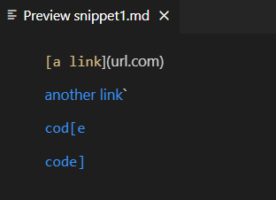
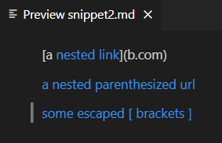
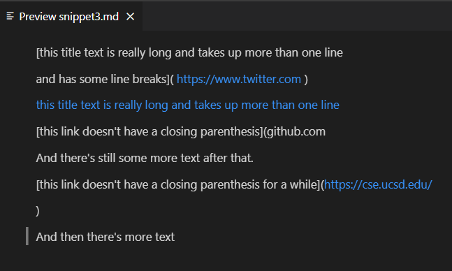
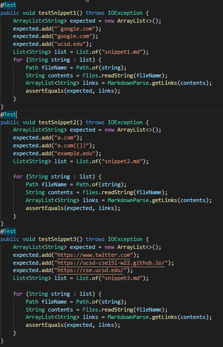
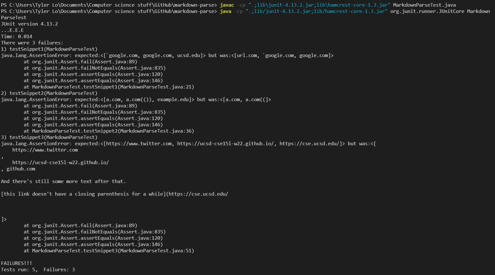
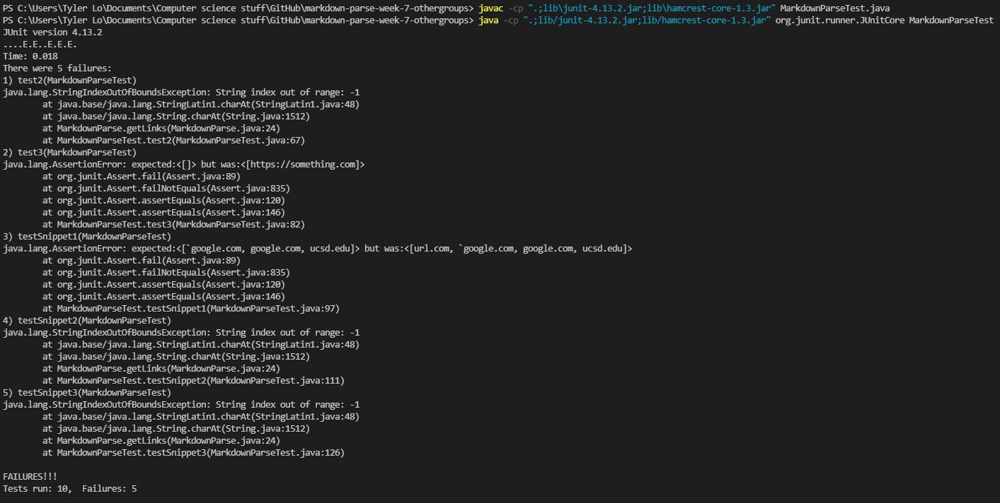
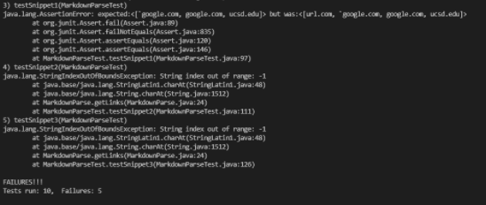

## Lab Report 4 Week 8
-------------------------

# Expected output for the 3 snippets #

For snippet 1, the Preview shows that ```another link``` , ```cod[e``` , and ```code]``` are all links. Therefore, ``` `google.com ``` , ``` google.com ``` , and ``` ucsd.edu ``` should be added to the ArrayList. 



For snippet 2, the Preview shows that ```nested link``` , ```a nested parenthesized url``` , and ```some escaped [ brackets ] ``` are all links. Therefore, ```a.com``` , ```a.com(())``` , and ```example.com``` should be added to the ArrayList.



For snippet 3, ```https://www.twitter.com``` , ```this title text is really long and takes up more than one line``` , and ```https://cse.ucsd.edu/``` are links. Therefore, ```https://www.twitter.com``` , ```https://ucsd-cse15l-w22.github.io/``` , and ```https://cse.ucsd.edu/``` should be added to the ArrayList.




# Markdown-parse tests #

My markdown-parse repository: [link](https://github.com/TylerLo416/markdown-parse.git)

My markdown-parse tests: 

Result of the output of the tests: 


Reviewed markdown-parse repository: [link](https://github.com/TheZenMasterz/markdown-parse.git)

Markdown-parse tests for the reviewed repository (same tests): 

Result of the output of the tests: 

Specific test output errors: 

# Snippet 1 Changes #

I think that the easiest solution is to check for extra close / open brackets that are within other brackets. If there are brackets that are inside other brackets followed up by subsequent brackets that should be used as the closing bracket, the last closing bracket should be used. This can be done with a while loop that checks up until the next open parenthesis, checking for the last close bracket.

# Snippet 2 Changes #

I think the best solution again is a while loop that until it finds the next open bracket, checks all characters until it finds the last close parenthesis, and uses that last close parenthesis. This might not be able to be done in less than 10 lines, because this must be done for both the closing brackets and open brackets.

# Snippet 3 Changes #

I think that checking for ```\n``` line breaks using an if statement as well as using a for loop to check for and remove any empty space in between characters can shorten the md file and make it so that the code does not have to account for empty space in the rest of the method.