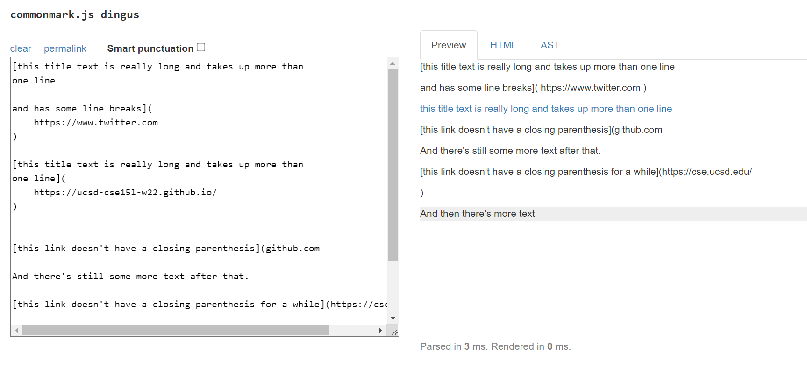
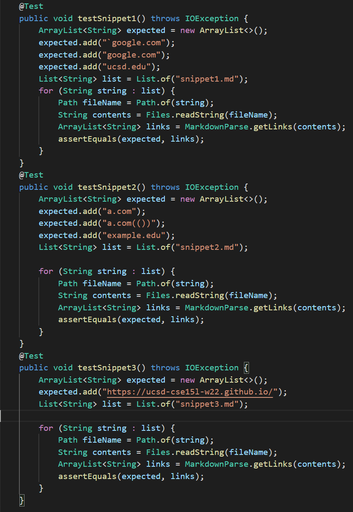
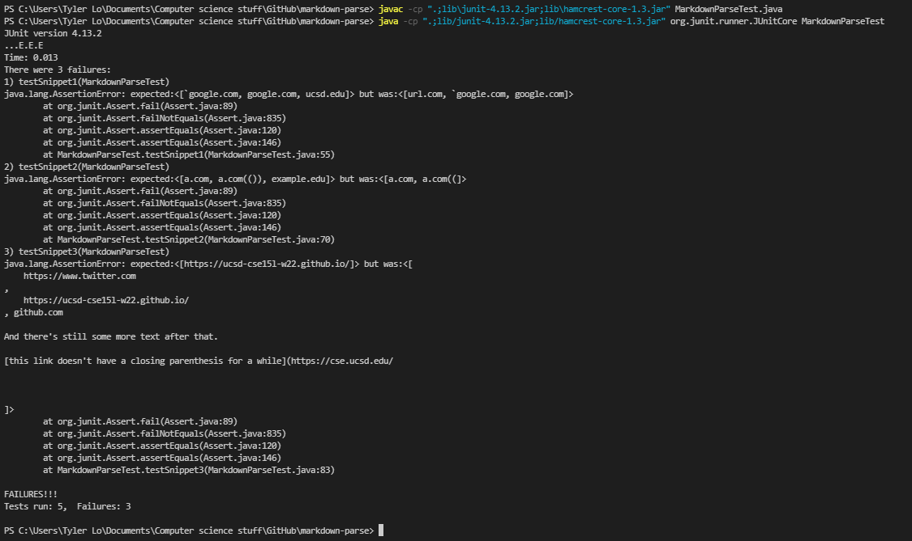
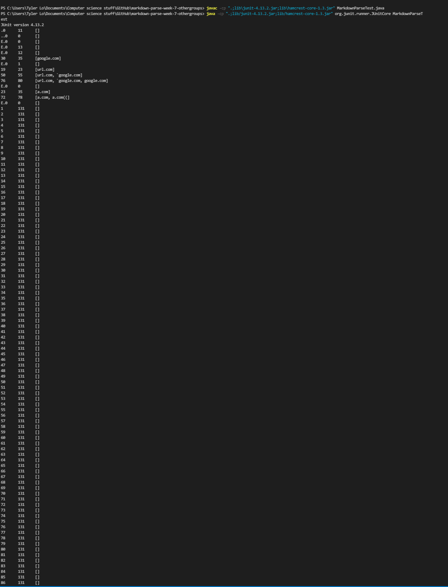
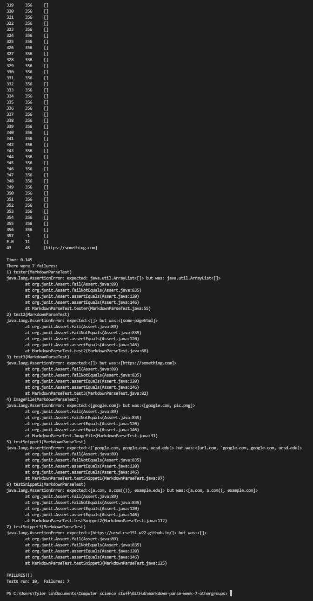
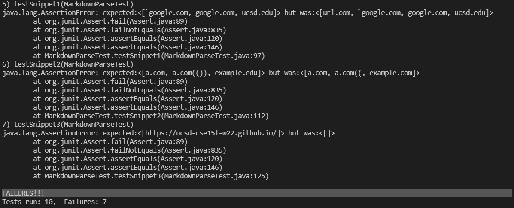

## Lab Report 4 Week 8
-------------------------

# Expected output for the 3 snippets #

For snippet 1, the Preview shows that ```another link``` , ```cod[e``` , and ```code]``` are all links. Therefore, ``` `google.com ``` , ``` google.com ``` , and ``` ucsd.edu ``` should be added to the ArrayList. 


For snippet 2, the Preview shows that ```nested link``` , ```a nested parenthesized url``` , and ```some escaped [ brackets ] ``` are all links. Therefore, ```a.com``` , ```a.com(())``` , and ```example.com``` should be added to the ArrayList.


For snippet 3, ```this title text is really long and takes up more than one line``` is the only link. Therefore, ```https://ucsd-cse15l-w22.github.io/``` should be added to the ArrayList.




# Markdown-parse tests #

My markdown-parse repository: [link](https://github.com/TylerLo416/markdown-parse.git)

My markdown-parse tests: 

Result of the output of the tests: 


Reviewed markdown-parse repository: [link](https://github.com/TheZenMasterz/markdown-parse.git)

Markdown-parse tests for the reviewed repository (same tests): 

Result of the output of the tests: 


Specific test output errors: 

# Snippet 1 Changes #

I think that the easiest solution is to check for extra close / open brackets that are within other brackets. If there are brackets that are inside other brackets followed up by subsequent brackets that should be used as the closing bracket, the last closing bracket should be used. This can be done with a while loop that checks up until the next open parenthesis, checking for the last close bracket.

# Snippet 2 Changes #

I think the best solution again is a while loop that until it finds the next open bracket, checks all characters until it finds the last close parenthesis, and uses that last close parenthesis. This might not be able to be done in less than 10 lines, because this must be done for both the closing brackets and open brackets.

# Snippet 3 Changes #

I think that checking for ```\n``` line breaks using an if statement as well as using a for loop to check for and remove any empty space in between characters can shorten the md file and make it so that the code does not have to account for empty space in the rest of the method.

# Post resubmit #
Note - After re-submitting this lab, the week-7 repository I was reviewing and running tests on was updated, and I couldn't find the commit that I was previously working on, so the tests are now different for snippet tests 1-3 (not just 3, which I was redoing). However, the Snippet 1-3 changes that I suggest still stand to improve the MarkdownParse and solve many of the issues that still come up with the newly updated markdown-parse.

# Snippet 3 Changes Post-Redo #

All of the above changes still stand. However, using the java ```replaceAll()``` method to remove the empty spaces between brackets and parenthesis would solve the error that markdown parse doesn't catch parenthesis and brackets when they are on different lines.