## Lab Report 5 Week 10 ##
-------------------------

# Searching for 2 tests with different results #

I manually searched through test files until I found 2 test files that had different answers than the week 9 implementation. To do this, I printed out all the tests on the week 9 implementation, and then with my own markdown parse ```getLinks()``` method. I used the same provided Map ```getLinks``` method to print out the test results for both repositories. I then checked for discrepencies between the outputs and found 2 tests that had different outputs from the week 9 repository and my groups repository.

Code I used to print out the tests for both my repository and the given repository
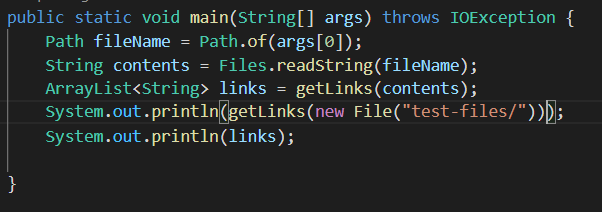

Week 9 repository:
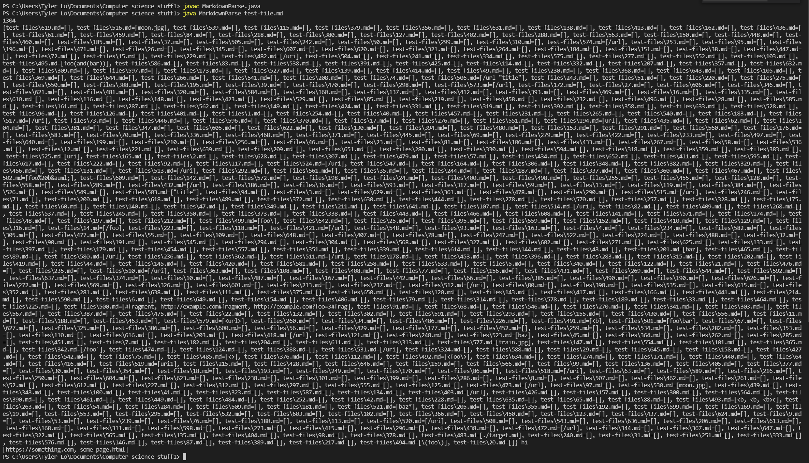

My groups repository: 
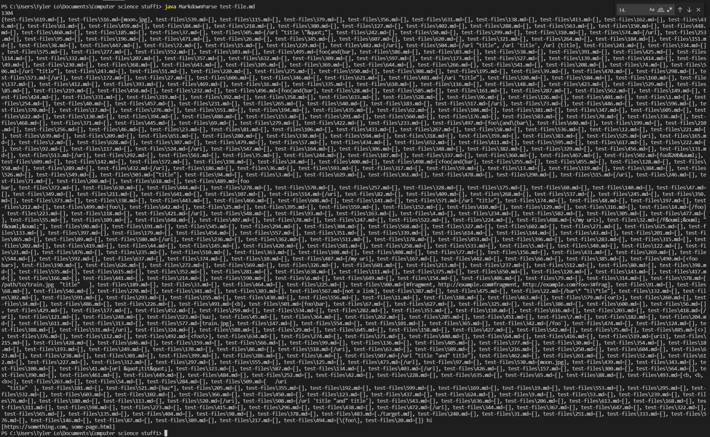

# Bug 1: test 489 #

Week 9 repository test 489: 
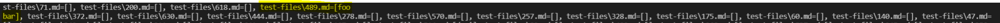

My groups repository:
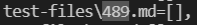

Contents of test ```489.md```:

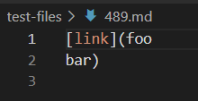

Commonmark preview of the contents of test 489:

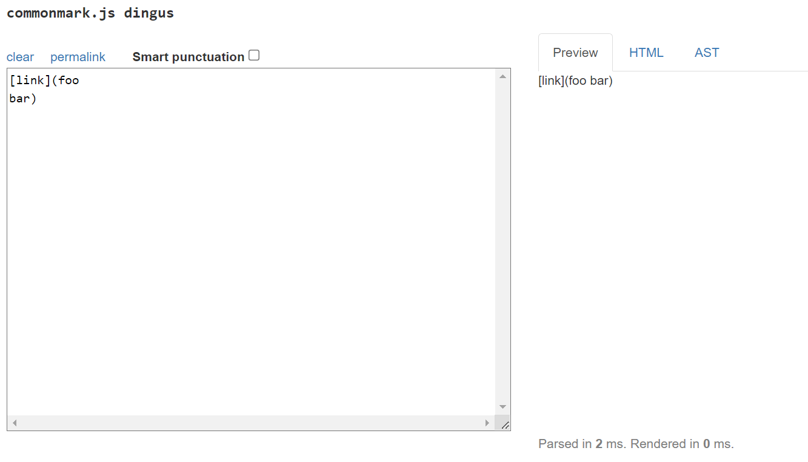

As shown in the commonmark preview, there is no link. Therefore, my groups repository was incorrect, because it returned a link. 

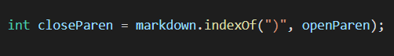

The error in my groups repository was that the ```closeParen``` automatically jumps to the index of the next closed parenthesis. However, if there is a line break in between the open and close parenthesis, the link will not work properly. Therefore, there should be an if statement that checks for line breaks in between open paren and close paren, and if there is a line break, it skips past closed paren and onto the next link without adding anything to the arrayList.

# Bug 2: test 505 #

Week 9 repository test 505:
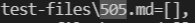

My groups repository:
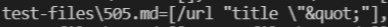

Contents of test ```505.md```:

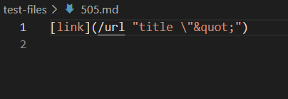

Commonmark preview of the contents of test 505:

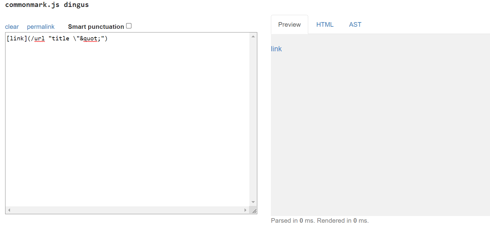

As shown in the commonmark preview, ```505.md``` should produce a link. This means that the week 9 output is incorrect because it does not return a link, but my group's repository has the correct output. 


The error in the week 9 repository is that the link is disregarded if there is a space in it, when in reality it is acceptable to have a space if the next character after the space is a quotation mark. Because of this, there needs to be an additional if statement that checks if the character after a space is a quotation mark, which in that case will make the link continue to function regardless of the space (the space is actually required when there is a quotation mark in the link).