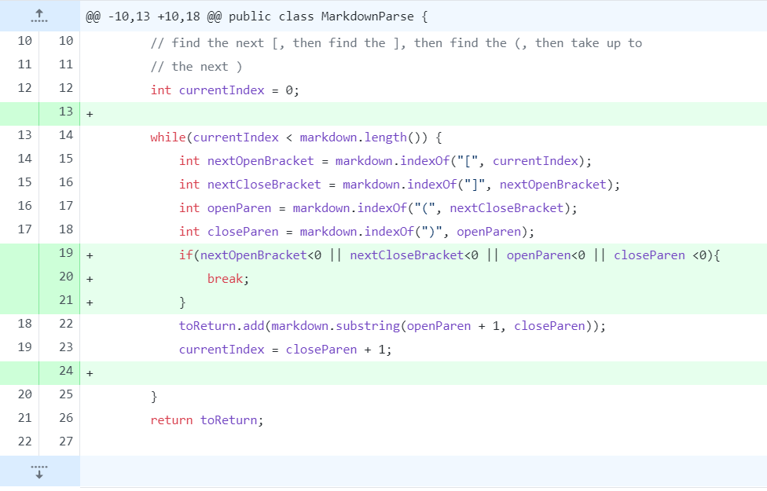
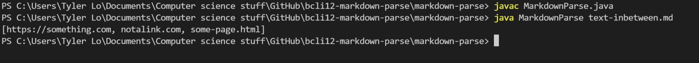
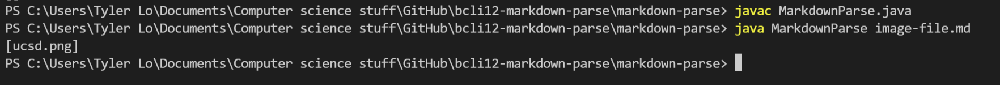
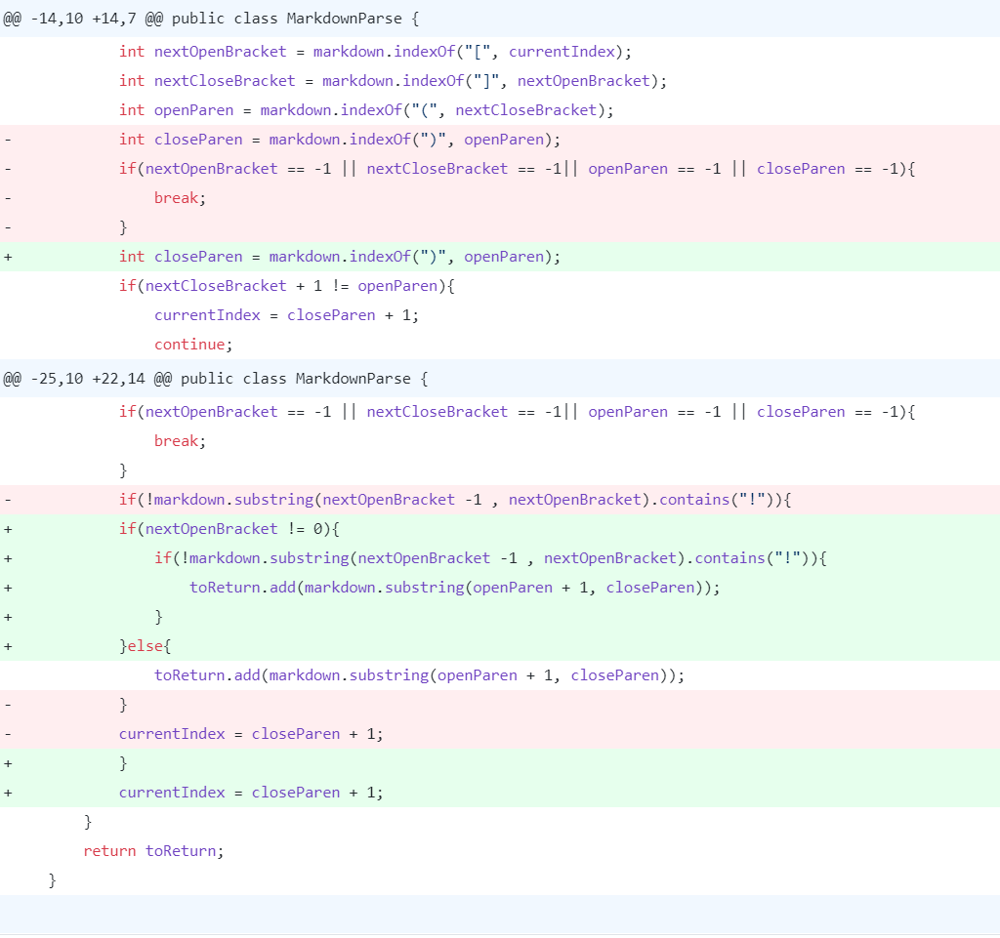
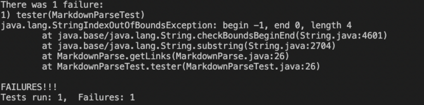

## Lab Report 5 Week 10 ##
-------------------------

# Bug 1 #

The first bug was that if there was code between the ```]``` and the next ```(``` the code would fail to find the correct website link.



Test file that caused this failure inducing input: [link](https://github.com/bcli12/markdown-parse/blob/main/text-inbetween.md)

Symptom of the failure inducing input:


As shown, the terminal outputs **notalink.com** even though this link should not actually be printed because there is code in between the ```]``` and ```(```
The bug was placed next to the **notalink.com** link, and directly caused this link to appear. The symptom was shown in the terminal, when the **notalink.com** was an output even though the program should not recognize it as a link.
To resolve this, an if statement is used to check if the next character in the String is a ```(```. If the next character is not a ```(```, it will not output a link.

# Bug 2 #

The second bug was that the code did not determine whether the link inside of the test file was actually a legitimate link that led to a website. The example was using an image file which is not a link.


*Note: it is the same commit image as the first bug because our lab solved both problems before commiting*

Test file that causes this failure inducing input: [link](https://github.com/bcli12/markdown-parse/blob/main/image-file.md)

Symptom of the failure inducing input: 

As shown, the terminal prints out **ucsd.png** as its output, even though this isn't a webpage link, but rather an image file. The original link was replaced with the ucsd.png link instead. This caused the symptom of the output not actually containing a link. 
To resolve this, an if statement is added to check if the input from the test file starts with an exclamation mark to determine whether or not there is an actual link in the input. If there is no exclamation mark, as with **ucsd.png**, than it will not be given as a valid link in the output.

# Bug 3 #

The third bug was that a file with no link but still contains the brackets and parenthesis: ```[]()``` would cause a StringIndexOutOfBoundsException 


Test file that causes this failure inducing input: [link](https://github.com/bcli12/markdown-parse/blob/main/empty-link.md)

Symptom of the failure inducing input:


The terminal throws an index out of bounds exception because it cannot find any text within the parenthesis, and as a result the substring fails to find an endpoint. The bug was the program trying to utilize a substring method that attempted to find text even if there was any. The symptom ```IndexOutOfBoundsException``` in this case directly pointed to the problematic line, where the empty parenthesis (failure inducing input) caused the substring to look for an index that wasn't there.
To resolve this, adding an if statement to check if there is text in betweeen the ```()``` prevents this issue from occuring. If there is no text, the program returns nothing rather than producing an error. 