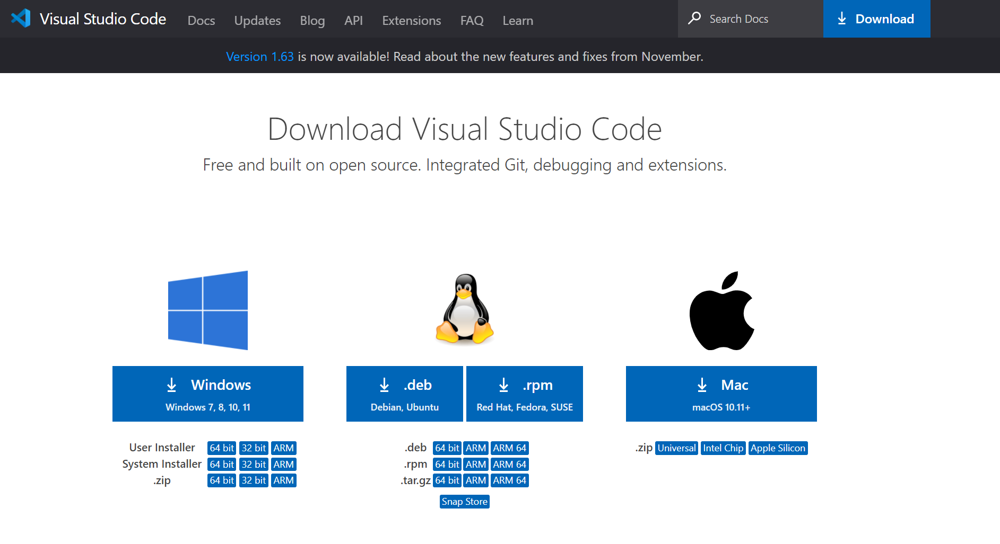
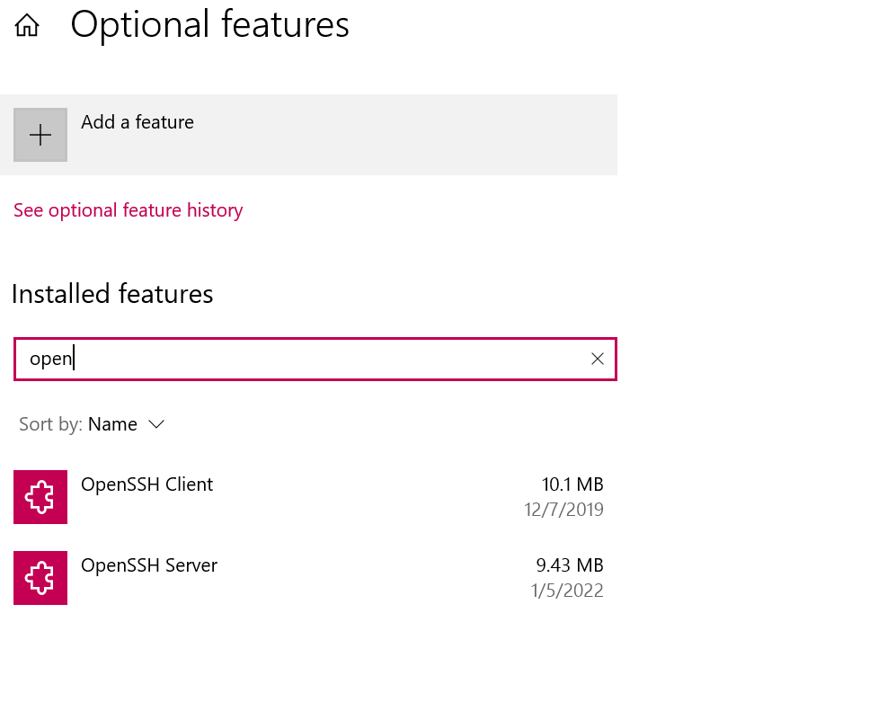

#Installing VS Code#
Go to the VS code download page: [link](https://code.visualstudio.com/)
I have already downloaded it but this is what the download page looks like

#Remotely Connecting#
The first step is to install open-ssh client and open-ssh server. This is done by in the Optional Features Windows settings by clicking add a feature and finding open ssh.
Steps to install open-ssh can be found here: [link](https://docs.microsoft.com/en-us/windows-server/administration/openssh/openssh_install_firstuse)
