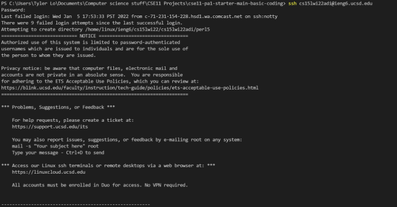
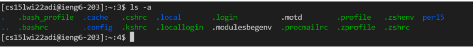
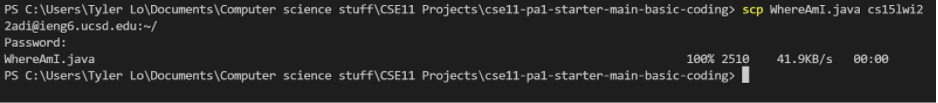
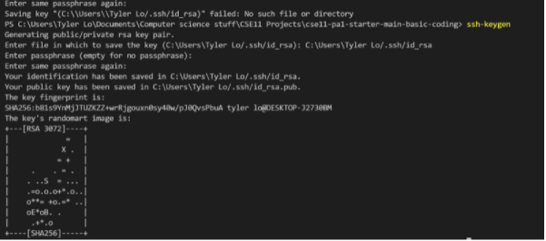
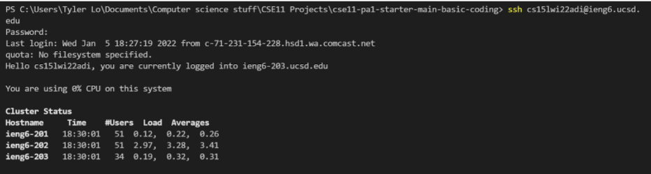

# Installing VS Code #
Go to the VS code download page: [link](https://code.visualstudio.com/)
I have already downloaded it but this is what the download page looks like

# Remotely Connecting #
The first step is to install open-ssh client and open-ssh server. 
This is done by in the Optional Features Windows settings by clicking add a feature and finding open ssh.
Steps to install open-ssh can be found here: [link](https://docs.microsoft.com/en-us/windows-server/administration/openssh/openssh_install_firstuse)

Next step is to find your CSE15L account through this link: [link](https://sdacs.ucsd.edu/~icc/index.php)
Then in the VS code terminal, use the **ssh cs15lwi22???ieng5.ucsd.edu** with your personal CSE15L account and use your Student ID password.

# Trying Some Commands #
Now that you are logged into the ieng6 server, you can run some basic commands in the VS code terminal. 
For example, this command **ls-a** causes teh terminal to show all hidden and non-hidden directories in color coded format

# Moving Files With SCP #
You can move files from the client to the server by using the command scp. In this instance, **scp WhereAmI.java cs15lwi22???@ieng6.ucsd.edu:~/ moved the program WhereAmI.java to the ieng6 server.

# SSH Keys #
To reduce the amount of time to login to the remote server, you can eliminate or rewrite your password for your CSE15L account to not have to type it in.
To do this, run the command **ssh-keygen** and follow the prompts in the terminal.

I have a macro on my keyboard for a password, so I chose to keep that password to protect my account, however this still drastically reduced the amount of time needed to log in.

# Optimizing Remote Running #
